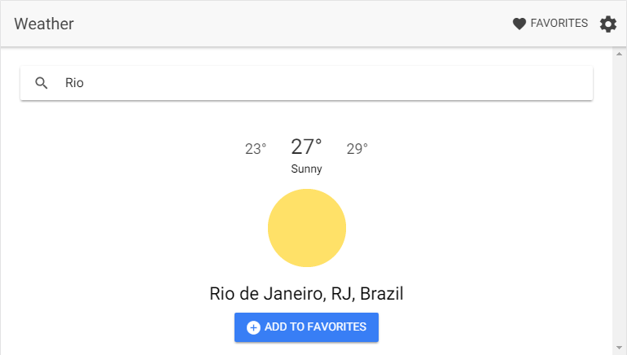

# ionic-weather
A simple and beautiful weather web app using Ionic 2 and Angular 2

## Getting Started
* Clone this repository.
* Run `npm install` from the project root.
* Install the ionic CLI (`npm install -g ionic`)
* Run `ionic serve` in a terminal from the project root.
